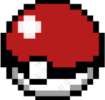
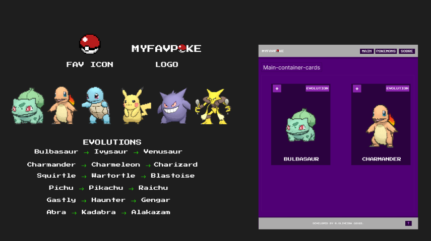

<h1 style="display:inline">MY FAVORITE POKEMON</h1>

<h2>My Favorite Pokemon é um projeto que visa mostrar os meus pokemons preditos, que marcaram minha infância e também, claro, praticar as tecnologias que estou estudando.</h2>

Desenvolvido 100% por mim, desde o layout até o código. Segue link para o figma do projeto <strong><a href="https://www.figma.com/file/XDysrDjvWhPhV5EEZo7Ybh/MYFAVPOKE?node-id=2%3A10&t=b4MgxGCF6rNkppG7-1" target="_blank">Figma - MYFAVPOKE</a></strong>

<h2>Tecnologias utilizadas</h2>

HTML  |
CSS  |
JavaScript 

<h2>Descrição:</h2>

Projeto desenvolvido com o objetivo de praticar a manipulação da DOM através do JavaScript. 

 
<h2>Confira o projeto clicando no link abaixo</h2>
  
<a align="center" href="" target="_blank">
Confira
</a>
  

